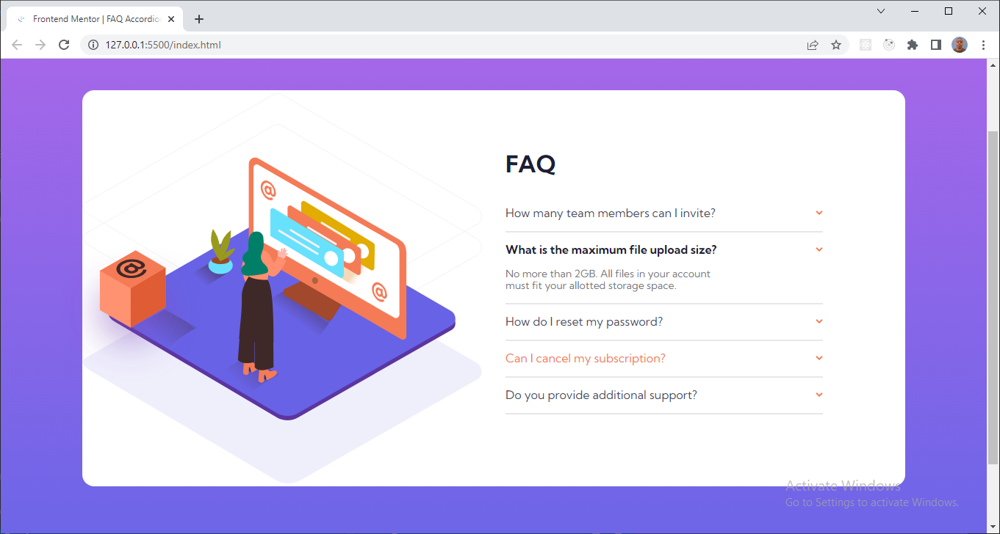

# Frontend Mentor - FAQ accordion card solution

This is a solution to the [FAQ accordion card challenge on Frontend Mentor](https://www.frontendmentor.io/challenges/faq-accordion-card-XlyjD0Oam). Frontend Mentor challenges help you improve your coding skills by building realistic projects.

## Table of contents

- [Overview](#overview)
  - [The challenge](#the-challenge)
  - [Screenshot](#screenshot)
  - [Links](#links)
- [My process](#my-process)
  - [Built with](#built-with)
  - [What I learned](#what-i-learned)
- [Author](#author)

## Overview

### The challenge

Users should be able to:

- View the optimal layout for the component depending on their device's screen size
- See hover states for all interactive elements on the page
- Hide/Show the answer to a question when the question is clicked

### Screenshot



### Links

- Solution URL: [Add solution URL here](https://github.com/prince-udum/faq-accordion-card)
- Live Site URL: [Add live site URL here](https://your-live-site-url.com)

## My process

### Built with

- Semantic HTML5 markup
- CSS custom properties
- Flexbox
- CSS Grid
- Mobile-first workflow
- Javascript - for functionality

**Note: These are just examples. Delete this note and replace the list above with your own choices**

### What I learned

I learnt alot from this project. One of the major thing i learn was the part when i added a javascript code that toggles the answer to the FAQ question and also no two questions anwers can be open at the same time.

Here is the code below:

```html
<article class="question">...</article>
```

```css
.question-text {
  display: none;
}
.show-text .question-text {
  display: block;
}
```

```js
questions.forEach((question) => {
  // select question title
  const questionTitle = question.querySelector(".question-title");
  questionTitle.addEventListener("click", () => {
    console.log(question);

    questions.forEach(function (item) {
      if (item !== question) {
        item.classList.remove("show-text");
      }
    });

    question.classList.toggle("show-text");
  });
});
```

## Author

- Frontend Mentor - [@prince-udum](https://www.frontendmentor.io/profile/prince-udum)
- Twitter - [@princeudum](https://www.twitter.com/princeudum)
